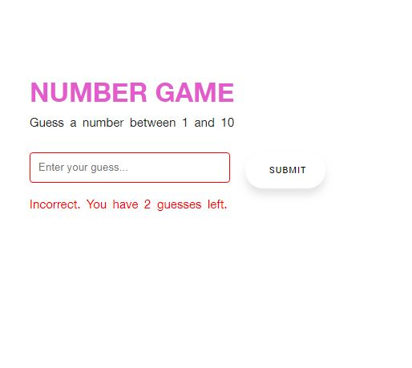
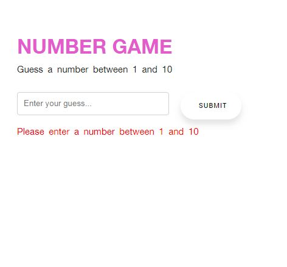

# NUMBER GAME

Live on - https://shomikg.github.io/LoanCalculator/
A short interactive game developed using Vanilla JS which makes users judge a random number just in 3 guesses.

## Technologies Used in this repo

* JavaScript ES6: plain JS (as opposed to jQuery, etc.) is used to dynamically query, create, modify, and remove HTML elements/nodes
* Skeleton: front-end CSS framework

## Features

1. A message appears if the user submits without giving any input.

2. The app keeps a count of the chances which it notifies about, each time the user inputs a value.

   

## Thoughts

Validation in Javscript is so much fun.
